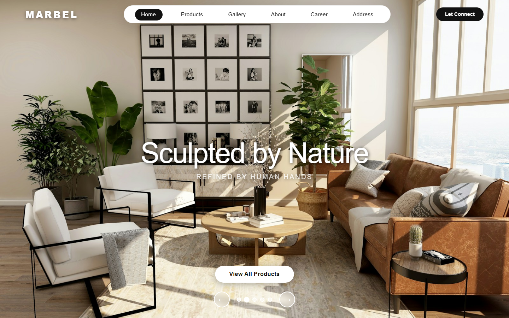
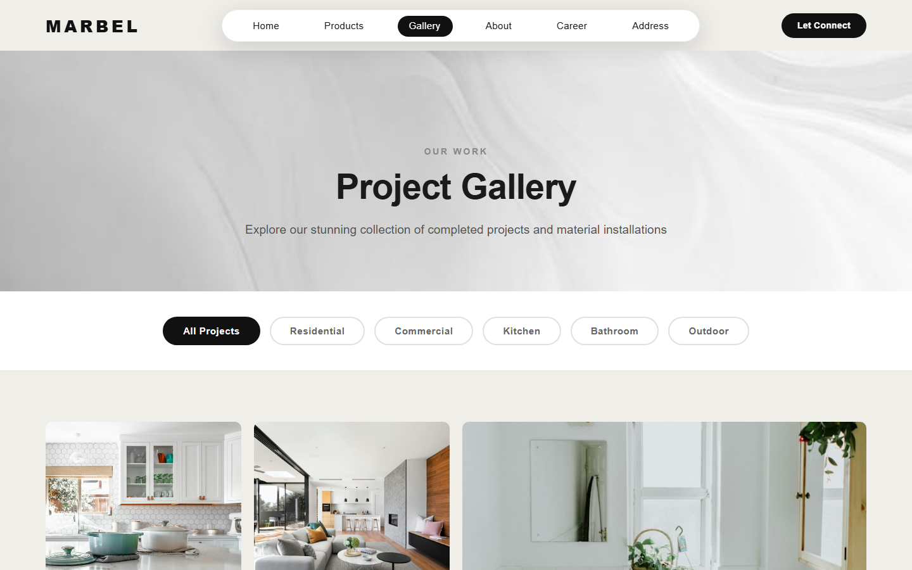
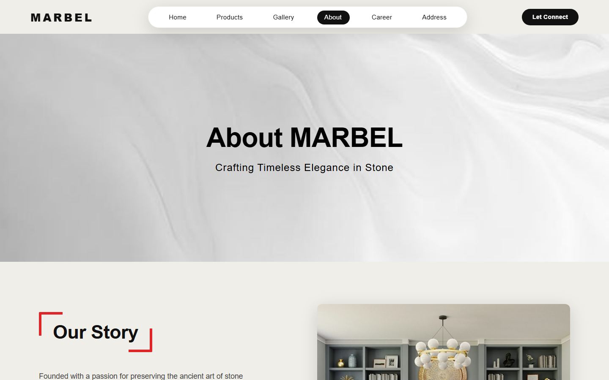

# MARBEL – Luxury Stone Product Webpage

A full-stack website for **MARBEL**, a luxury granite and marble brand. It has a public showcase site (home, products, gallery, about, careers) and an admin dashboard for managing products and job openings. A Spring Boot REST API backs it, with MySQL for storage and AWS S3 for product images.

## Screenshots

| Home | Gallery |
|---|---|
|  |  |

| About |
|---|
|  |

## Features

- **Home** – hero slider, featured collections, contact modal
- **Products** – granite and marble collections with a product details page
- **Gallery** – filterable project gallery (Residential, Commercial, Kitchen, Bathroom, Outdoor) and video showcase
- **About** – brand story
- **Career** – open positions with filters (location, department, role type, experience, skills)
- **Admin dashboard** – manage products (with S3 image upload) and view stats
- REST API with validation, CORS configuration and DTOs

## Tech Stack

| Layer | Technology |
|---|---|
| Backend | Java 21, Spring Boot 3.2.5, Spring Web, Spring Data JPA (Hibernate), Bean Validation, Lombok |
| Database | MySQL 8 |
| Storage | AWS S3 (SDK v2) |
| Frontend | HTML, CSS, vanilla JavaScript |
| Build | Maven (wrapper included) |

## Project Structure

```
Marbel_Product_Webpage/
├── pom.xml
└── src/main/
    ├── java/com/marbel/
    │   ├── MarbelApplication.java
    │   ├── config/        # CORS and web config
    │   ├── controller/    # ProductController, JobPositionController
    │   ├── dto/           # ProductDTO, ProductRequest
    │   ├── entity/        # Product, JobPosition
    │   ├── repository/    # JPA repositories
    │   └── service/       # ProductService, JobPositionService, S3Service
    └── resources/
        ├── application.yml
        └── Static/
            ├── Pages/     # Home, Products, Gallery, About, Career
            ├── admin/     # Admin dashboard
            ├── css/  js/  # Shared styles and scripts
            └── assets/    # Images
```

## Getting Started

### Prerequisites

- JDK 21
- MySQL 8+
- An AWS S3 bucket and credentials (for product image uploads)

### Setup

1. **Clone**
   ```bash
   git clone <repo-url>
   cd Marbel_product_webpage/Marbel_Product_Webpage
   ```
2. **Create the database**
   ```sql
   CREATE DATABASE marbel_db;
   ```
3. **Configure** `src/main/resources/application.yml`
   ```yaml
   spring:
     datasource:
       username: root
       password: your_password
   aws:
     s3:
       bucket-name: your-bucket
       region: us-east-1
     accessKey: YOUR_AWS_ACCESS_KEY
     secretKey: YOUR_AWS_SECRET_KEY
   ```
   > Don't commit real credentials. Prefer environment variables or a local, git-ignored config.
4. **Run**
   ```bash
   ./mvnw spring-boot:run      # Windows: mvnw.cmd spring-boot:run
   ```
5. Open <http://localhost:8080>. It redirects to `/Pages/Home/index.html`.

## API Endpoints

Base URL: `http://localhost:8080/api`

| Method | Endpoint | Description |
|---|---|---|
| GET | `/products` | List products |
| GET | `/products/{id}` | Get a product |
| POST | `/products` | Create a product |
| PUT | `/products/{id}` | Update a product |
| DELETE | `/products/{id}` | Delete a product |
| GET | `/products/admin/stats` | Dashboard statistics |
| GET | `/jobs` | List job positions |
| GET | `/jobs/{id}` | Get a job position |
| POST | `/jobs` | Create a job position |
| PUT | `/jobs/{id}` | Update a job position |
| DELETE | `/jobs/{id}` | Delete a job position |

## Notes

- Uploads are limited to 5 MB per file (10 MB per request).
- Product images are served from S3, so the Products page needs a running backend and valid AWS configuration.
